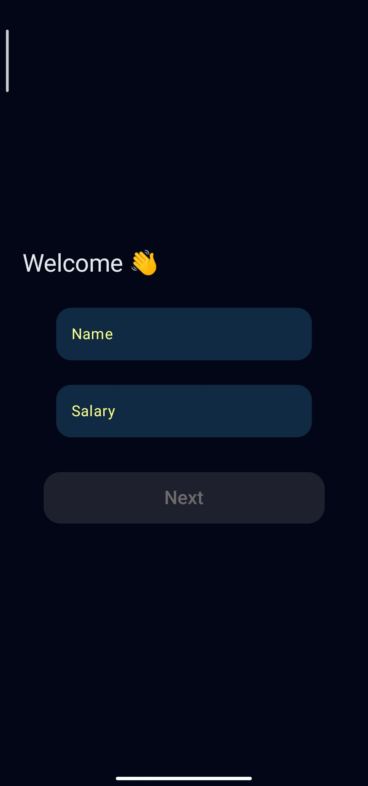
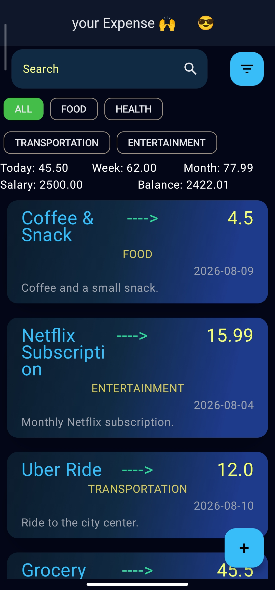
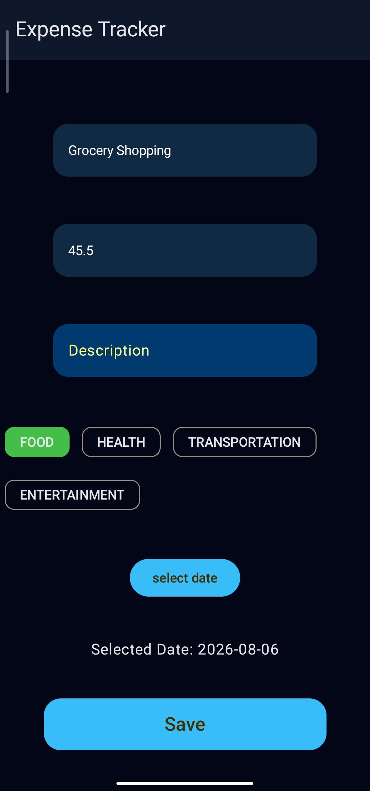

# Expense Tracker — Android

A modern Android expense tracking application built with Kotlin and Jetpack Compose.

> A personal Android project focused on local data persistence, expense management, dashboard analytics, filtering, and structured application architecture.

## Features

* Create and edit expenses
* Delete expenses
* Track expense categories
* Filter expenses
* Select expense dates
* View expense history
* Dashboard with financial summaries
* Weekly expense visualization
* Monthly expense visualization
* Onboarding flow
* Local data persistence with Room
* Reactive UI state management
* Navigation between application features

## Screenshots

<p align="center">
  
  
  
</p>

## Tech Stack

### Language & UI

* Kotlin
* Jetpack Compose
* Material 3

### Architecture

* MVVM
* Layered Architecture
* Repository Pattern
* Dependency Separation
* UI State Management

### Android

* ViewModel
* Navigation Compose
* Coroutines
* Flow

### Local Data

* Room
* SQLite

### Data Modeling

* Database Entities
* Domain Models
* UI Models
* Mappers
* Type Converters

### Visualization

* Weekly Line Chart
* Monthly Bar Chart

## Architecture

Expense Tracker uses a layered architecture with MVVM to separate UI, presentation, domain, and data responsibilities.

```text
Jetpack Compose UI
        ↓
    ViewModel
        ↓
    Repository
        ↓
      Room
        ↓
     SQLite
```

The project separates database entities from domain models and UI models using dedicated mappers.

ViewModels expose UI state and handle user interactions, while repositories provide an abstraction over local data operations.

## Project Structure

```text
app/
└── src/main/java/com/example/expensetracker/
    ├── data/
    │   ├── converters/
    │   ├── database/
    │   │   ├── expense/
    │   │   └── user/
    │   ├── DataRepositores/
    │   └── mapper/
    │
    ├── domain/
    │   ├── model/
    │   └── repository/
    │
    ├── route/
    │
    ├── ui/
    │   └── theme/
    │
    ├── view/
    │   ├── addEditExpense/
    │   ├── composable/
    │   ├── dashboardDetails/
    │   ├── listExpense/
    │   └── onboarding/
    │
    ├── viewModel/
    │   ├── mapper/
    │   ├── model/
    │   └── state/
    │
    ├── MainActivity.kt
    └── MyExpense.kt
```

## Technical Highlights

* Implemented local persistence using Room with separate databases, DAOs, and entities.
* Separated database entities from domain models using dedicated mappers.
* Implemented Repository interfaces in the domain layer with concrete implementations in the data layer.
* Structured application state using dedicated UI state models.
* Implemented ViewModels for onboarding, dashboard, expense list, expense editing, and user state.
* Implemented navigation using Navigation Compose.
* Added reusable Compose components for text fields, buttons, dialogs, filters, and expense cards.
* Implemented expense filtering and date selection.
* Added dashboard financial summaries.
* Implemented weekly and monthly expense charts.
* Used Room type converters for database-specific data types.
* Separated UI models from domain models using dedicated UI mappers.

## Data Flow

```text
User Interaction
       ↓
Compose UI
       ↓
ViewModel
       ↓
Domain Repository
       ↓
Repository Implementation
       ↓
Room DAO
       ↓
SQLite Database
```

For displaying data:

```text
SQLite
   ↓
Room Entity
   ↓
Repository
   ↓
Domain Model
   ↓
UI Mapper
   ↓
UI Model
   ↓
Compose UI
```

## Local Storage

The application uses Room for local persistence.

The data layer contains:

* Room databases
* DAOs
* Database entities
* Type converters
* Repository implementations
* Entity-to-domain mappers

No external backend service is required to run the application.


## Setup & Configuration

### Requirements

* Android Studio
* JDK compatible with the project's Gradle configuration
* Android SDK

### Running the Project

1. Clone the repository.
2. Open the project in Android Studio.
3. Sync the Gradle project.
4. Build and run the application on an Android device or emulator.

No external API keys or backend configuration are required.

## Project Status

**Completed personal project.**

The project demonstrates practical experience with Kotlin, Jetpack Compose, MVVM, Repository Pattern, Room, local persistence, navigation, reactive UI state, and data modeling.
